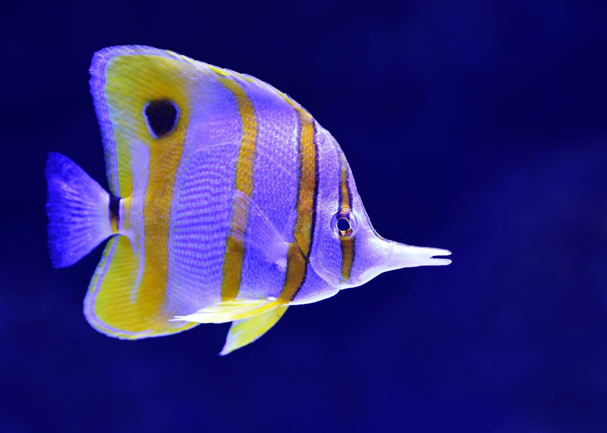

> "Make everything as simple as possible, but not simpler." - Albert Einstein

There I was, promising myself I was only going to play one more game of rocket league. The addictive video game where soccer meets rocket powered cars. I tell my friends to hold on a minute, while I run to the freezer and serve up another bowl of ice cream. I got to the freezer and grabbed the whole carton and ran back to my computer. I moved aside the empty chip bags and crumpled up candy wrappers and got back to work. I was living the good life.

Fast forward 2 months. I just finished another 5 hour gaming binge. I promised myself I'd only play 1 hour but games these days are engineered to commandeer our brains and pump us with dopamine hits over and over. I knew it was time. Something had to change. I was reluctant, I had tried everything to stop gaming and to stop eating junk food but nothing worked and I could feel myself spiraling down and down.

## Focus on One Thing

I decided to find one small thing I could start doing to climb out of this mess. After probably way too much time on YouTube, I came to a 7 min core workout. I thought to myself, I can do anything for 7 mins. I fired up the video and I was not able to finish the first exercise. Discouraged but determined, I tried again the next night. And the next. And the next. After 2 weeks I could finish the whole workout. Little did I know, this tiny win was going to be the start to a multitude of changes that would transform my life.

## The Compounding Nature of Small Consistant Habits

I made a promise to myself that I would do my 7 min core workout every single night with a rest day on Sunday. What I soon found was the desire and the motivation to add a few more "bonus" workouts. I started to run once a week. I started adding an upper body and lower body day. Now don't get me wrong, I was not exercising for 2 hours a day. I'm all for doing the least amount of time and getting the most benefit from exercise. I started experimenting with new workouts and finally settled on the kettlebell training. All I needed was one piece of equipment and I could get in a powerful workout every day!

## Weekly Fish

The success I found with my approach exersice began to bleed into other areas of my life. I came up with the "Weekly Fish". Don't ask me why I call it that, I think it was a typo using the swipe feature on my phone and it just stuck.

I would choose just **one** thing to focus on each week. I slowly focused on my eating, then cutting down video games, putting my phone down when I got home for work to spend real time with my wife and kids and continued to choose one new fish each week. My goal this week is to wake up 30 mins earlier and start writing in this blog.

When you make a goal, start as small as possible and do it for a week. That consistancy will compound and build momentum until you look back one day and are amazed at how far you have come. I look at each week as an experiment and try to complete my goal each day. If I decide it's not adding value, I drop it and try something new the next week. What matters is that you are moving forward and building yourself into something great.
